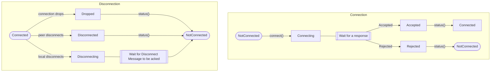

# Connection Status State Machine

The status of a client or peer connected to a server is mutated in two places.
1. The `tick()` function.
2. The `handle_status()` function.

When the user calls `handle_status()`, the status might change. 
This function gives the user a chance to handle any changes to the connection status.
For instance, if `handle_status()` returns `Disconnected`, the state will change to 
`NotConnected`. The `Disconnected` state contains the disconnection message. This
gives you an opportunity to handle the event of the peer disconnecting.
