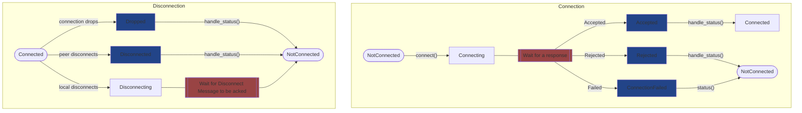

# Connection Status State Machine

The status of a client or peer connected to a server is mutated in two places.
1. The `handle_status()` method.
2. The `tick()` method.

Calling the `handle_status()` method returns the status of the connection. 
If the status was a transition type state (highlighted in blue above), the connection's
state will change after the function call. This gives the user an opportunity to handle
events relating to the connection's status. The user should call `handle_status()` at
the start of the game loop, right after the `tick()` call. 

If you want the status of the connection, but you don't want to handle these transition
events, you can use the `get_status()` method which does not mutate the status.

The state can also get mutated in the `tick()` method. If any of the waiting states
(highlighted in red) complete, the `tick()` method will move the connection to the 
next state.
